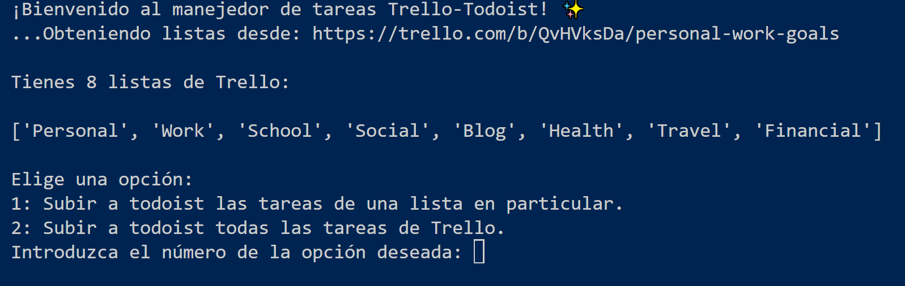
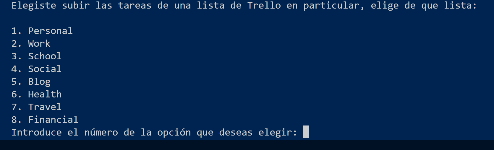

¡Bienvenido al manejedor de tareas Trello-Todoist! 📝🔄✅

Hola, éste programa automatiza el alta de tus tareas de Trello hacia Todoist. 

Instrucciones: 

Para clonar el repositorio desde github.com a local: 

git clone https://github.com/Moibe/trello2todoist

📦 Para instalar las librerías necesarias: 

pip install -r requirements.txt

El siguiente paso es prepara el archivo config.py antes de correr el programa: 

‼️ IMPORTANTE: Antes de correr el programa, editar el archivo config.py con la ruta en disco local de Chromium, por default este campo está vacío.

El archivo config.py tiene la siguiente estructura: 

configuracion = [
{"headless": False,
"url_trello": "https://trello.com/b/QvHVksDa/personal-work-goals",
"url_todoist": "https://app.todoist.com/auth/login",
"chromium_path": "D:\ChromiumB\chrome.exe",
"todoist_mail": "mail@example.com",
"todoist_pass": "password123"}
]

A continuación se explica cada punto: 

headless: puede ser True para no observar el navegador mientras se ejecutan las acciones o False para observarlo. (El valor no va entrecomillado.)
Ejemplo: "headless": False,

url_trello: Es la dirección de la lista pública de trello donde se pueden obtener las listas que se subirán.

url_todoist: Es la dirección de la página de inicio de sesión de Todoist. 

chromium_path: Es el path donde se encuentra la instalación de chromium en su disco local. 

todoist_mail: El correo para hacer login en Todoist.
Ejemplo: "mail@example.com",

todoist_pass: La contraseña para entrar a Todoist.

UNA VEZ EDITADO EL ARCHIVO CONFIG.PY EL ÚLTIMO PASO ES CORRER: inicio.py 

El programa obtendrá todas las listas de la url públicaa de Trello que le fue proporcionada. 

Habrá dos opciones para agregar listas: 1) Agregar solo las tareas de una lista determinada o 2) Agregar todas las tareas de una sola lista de Trello.

En caso de elegir la opción 1, ahora deberás elegir la lista para subir: 

El programa preparará los archivos, y listo, los subirá de forma automática a todoist con las credenciales previamente establecidas en el archivo config.py (para pruebas puedes usar la cuenta moibe.sun.tokyo@gmail.com que ya viene preconfigurada).

